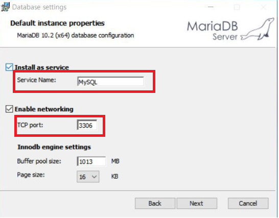
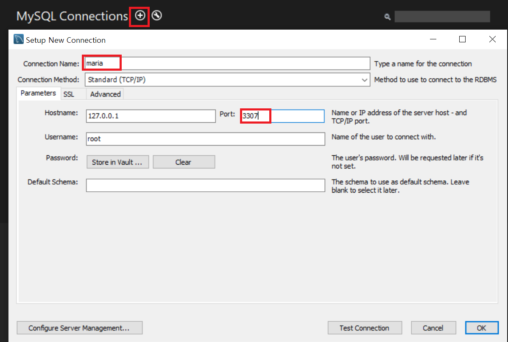
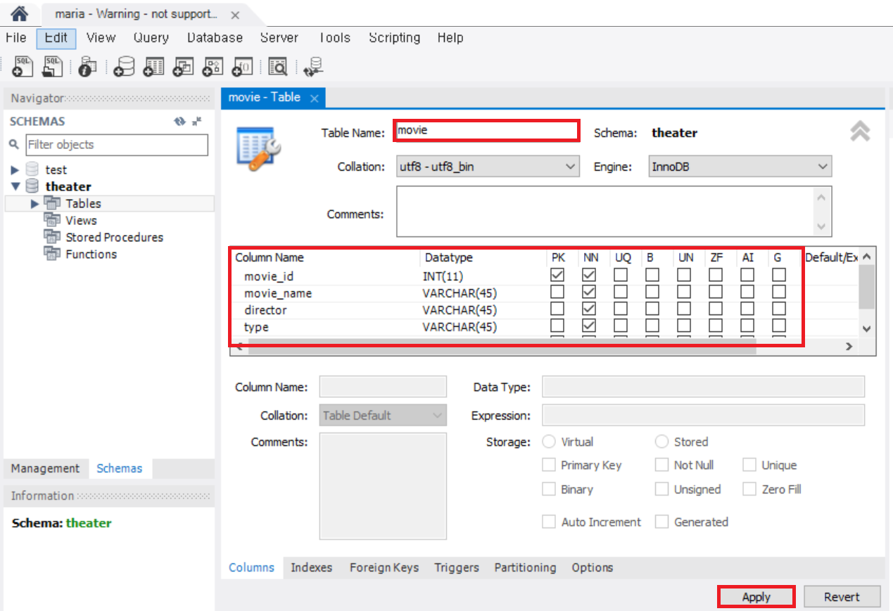
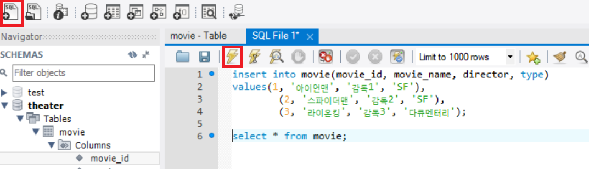

## DB구축

### 1. MariaDB 설치

- <https://downloads.mariadb.org/>
- mysql이 이미 설치된 경우
  - Service Name, TCP port 변경(mysql과 충돌 위험)
  
    

### 2. MySQL Workbench 설치

- <https://dev.mysql.com/downloads/workbench/>

  

### 3. 샘플 데이터 만들기

- 스키마 생성

  - Name : Theater

    Collation : utf8 - utf8_bin으로 설정 한 후 apply를 클릭하여 Schema 생성

- 테이블 생성
  
  
- 데이터 넣기 
  
  

