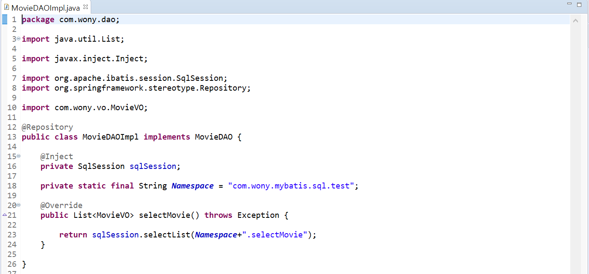

##  스프링, Mariadb, MyBatis 연동, 데이터 조회

### 1. pom.xml 수정

- mariadb, mybatis 관련 dependency를 추가
- 마지막 디펜던시인 **log4jdbc-log4j2-jdbc4.1**은 로그를 남기기 위한 라이브러리

  

  


### 2. root-context.xml 수정

- **root-context.xml**은 웹 이외의 부분을 셋팅하기 위해 존재하는 곳
- **datasource**는 db연결 정보로 "로컬주소/스키마"로 이루어져있고, ID와 패스워드를 입력합니다.
- 로그를 확인하기 위해 **log4jdb**를 property에 추가
- **sqlsessionfactoryBean**는 mariadb 설정기능을 사용하도록 세팅하고mapperLocation, 즉 sql 문을 mybatis/sql 경로에 있는 xml파일로 한다고 명시
- **SqlSessionTemplate**는 트랜잭션 관리와 쓰레드 처리, DB연결 및 종료를 관리하는 영역

  

  


### 3. mybatis, logback 파일 작성

​        

- mybatis-config.xml
  
  
- logback.xml
  
  
- log4jdbc.log4j2.properties 
  
  
-  test.xml
  
  
  
  - resultType가 "movieVO"로 데이터를 movieVO에 담겠다는 것을 의미
- log4j.xml 코드의 root logger 부분의 Value를 `warn`에서` info`로 수정


### 4. 데이터 조회/처리를 위한 JAVA코드 작성


- com.wony.dao

  - **MovieDAO.java**

    * MovieVO를 담고 있는 리스트를 가지는 함수가 있는 인터페이스

      

  - **MovieDAOImpl.java**

    * SqlSession을 통해 등록된 SQL 쿼리문을 실행하여 List를 리턴

      

    * MovieDAOImpl 작성 후 root-context.xml에 dao를 등록합니다.(스프링에서 스캔을 통해 빈으로 등록하게 하기위한 설정)

      `<context:component-scan base-package="com.wony.dao"></context:component-scan>`

- com.wony.service

  * 서비스는 비지니스 로직을 작성하는 곳이며, DB처리를 할 때 많이 이용

  * **MovieService.java**

    * 인터페이스로 작성

      

  * **MovieServiceImpl.java**

    

    * root-context.xml에 dao를 등록

      `<context:component-scan base-package="com.wony.service"></context:component-scan>`

- com.wony.vo

  * **MovieVo.java**

    

  * mybatis_테이블 underscore 형식(movie_Id)의 컬럼을 VO의 카멜케이스 변수(movieId)와 자동 매핑하기

    * mybatis-config.xml 추가(순서 주의 settings -> typeAliases)

      ```xml
      <configuration>
          <settings>
               <setting name="mapUnderscoreToCamelCase" value="true"/>
          </settings>
          ...
      </configuration>
      ```

- com.wony.settingweb

  * **HomeController.java**

    

    * controller에서는 service에서 selectMovie를 호출(sql 호출)하여 model에 담은 후 해당 내용을 화면으로 전달

      return "home"의 경우가 home.jsp 화면으로 전달한다는 내용

- view

  * **home.jsp**

    

    * home.jsp에서는 movieList를 받아 c:forEach 문으로 조회된 결과를 출

      실무에서는 보통 데이터를 json으로 받아와 Dom id를 설정한 후 javascript, jquery 등으로 동적으로 출력

- Tomcat 세팅

  - 구동하기 위한 톰캣을 더블 클릭하고 URL 설정 부분의 path를 "/내용" 에서 "/" 로 변경하면 localhost:8090으로 바로 첫 페이지를 구동 할 수 있습니다.

    

- 결과

  