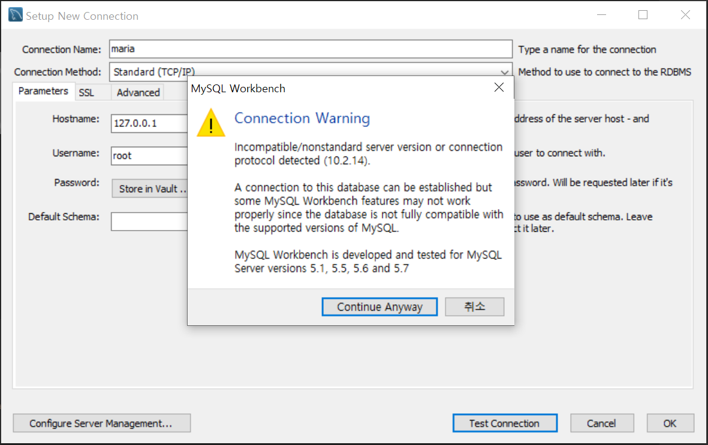

### 1. 개발환경 셋팅

- Github 계정 생성 (완료)
  - https://github.com/dpffpsk/project_data-visualization.git
- Visual Studio Code 설치 (완료)
- jquery, plotly 다운로드 (완료)
  - CDN 방식
- JDK/Tomcat/STS/MariaDB 설치 (완료)
  - jdk 1.8버전
  - Tomcat 8.0
  - STS 3.9.11.RELEASE
  - MariaDB 10.2.14


### 2. 이슈사항

- **Eclipse 안에 STS플러그인을 설치 오류**

  * `[문제]` Eclipse 안에 이미 Spring Tools 4를 설치하여 스프링
    부트 프로젝트를 진행하고 있어 Spring Tool 3 오류 발생

  * `[해결]` 이클립스 기반으로 된 STS를 Spring 프레임 워크 사이트에서 설치

    

- **mysql workbench에서 mariadb연결 오류**

  * `[문제]` mysql workbench에서 mariadb 연결시 경고 메시지 발생

    

  * `[해결]` 일단 Continue Anyway를 클릭하여 사용 중

    

- **root-context.xml 오류**

  * `[문제]` The
    prefix "context" for element "context:component-scan" is
    not bound. 오류 메세지

  * `[해결]` root-context.xml상단에 내용 추가

    ```xml
    xmlns:context="http://www.springframework.org/schema/context"
    xsi:schemaLocation="http://www.springframework.org/schema/context
    http://www.springframework.org/schema/context/spring-context-3.0.xsd”>
    
    ```

  

- **mybatis-config.xml 오류**

  * `[문제]` The content of element type "configuration" must match 

    "(properties?,settings?,typeAliases?,typeHandlers?,objectFactory?,objectWrapperFactory?,reflectorFactory?,plugins?,environments?,databaseIdProvider?,mappers?)". 오류메세지

  * `[해결]` settings -> typeAliases 순서의 문제