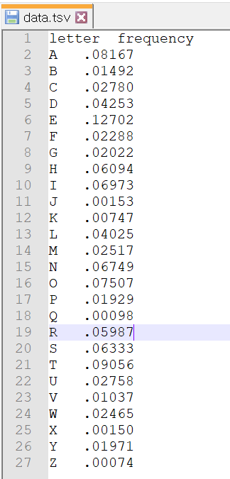

## D3.js

### 1. D3.js란

- 웹 브라우저상에서 동적이고 인터렉티브한 정보시각화를 구현하기 위한 자바스크립트 라이브러리

- 사용방식

  * 공식사이트(<https://d3js.org/>)에서 D3를 직접 다운받아 사용

  * CDN방식으로 사용

     ``

    

### 2. 차트 선택

- <https://d3js.org/> -> Example
  * <http://bl.ocks.org/Caged/6476579> (해당 차트 사용)

- tsv파일 생성

  