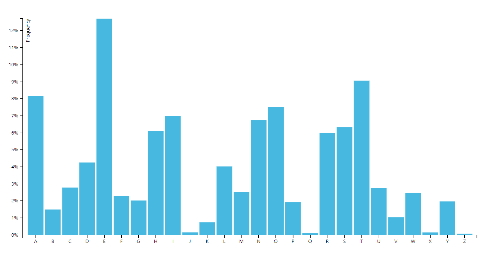

## Data Interface Guide

### [Bar Chart] TSV 응답 가이드_Version 1.0

1. 요청

   - 시각화 메인 화면에서 chart를 설정할 수 있습니다.

   - 사용자가 chart 데이터를 요청하면 데이터(.tsv)를 가져와 차트를 그립니다.

     

2. 응답

   * TSV파일 형식으로 chart를 위한 데이터를 제공합니다.

   * 차트에 필요한 파일(.tsv)을 읽어 데이터 요청에 응답합니다.   

   * TSV의 형식은 아래와 같습니다.

     ***
   
     letter&nbsp;&nbsp;&nbsp;&nbsp;frequency
     
     A&nbsp;&nbsp;&nbsp;&nbsp;.08167
     
     B&nbsp;&nbsp;&nbsp;&nbsp;.01492
     
     C&nbsp;&nbsp;&nbsp;&nbsp;.02780
     
     D&nbsp;&nbsp;&nbsp;&nbsp;.04253
     
     E&nbsp;&nbsp;&nbsp;&nbsp;.12702
     
     F&nbsp;&nbsp;&nbsp;&nbsp;.02288
     
     G&nbsp;&nbsp;&nbsp;&nbsp;.02022
     
     …
     
     ***
     
     * letter : x축 라벨
     
     * frequency : y축 라벨
     * letter의 값 : x축 값
     * frequency의 값: y축 값
     
     
   
3. chart library정보

   -  https://d3js.org

     

4. 차트샘플

   - 