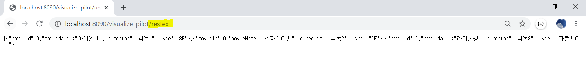

## RestController를 이용한 데이터 처리

1.  @RestController?

   - 기존의 특정한 jsp와 같은 뷰를 만들어 내는 것이 목적이 아니라 REST방식의 데이터를 처리하기 위해 사용하는 어노테이션이다. 이 때 반환되는 데이터로 사용되는 것은 단순 문자열, JSON, XML이다.

2. RestController를 위한 설정

   - settigweb 프로젝트와 같은 visualize_pilot를 생성

   - json을 이용하기 위한 Jackson library를 추가(pom.xml)

     ```xml
     <!-- jackson -->
             <dependency>
                 <groupId>com.fasterxml.jackson.core</groupId>
                 <artifactId>jackson-core</artifactId>
                 <version>2.9.2</version>
             </dependency>
             <dependency>
                 <groupId>com.fasterxml.jackson.core</groupId>
                 <artifactId>jackson-databind</artifactId>
                 <version>2.9.2</version>
             </dependency>
     ```

   - restContoller 파일 작성

     ```java
     package com.wony.visualize_pilot;
     
     import java.util.List;
     
     import javax.inject.Inject;
     
     import org.slf4j.Logger;
     import org.slf4j.LoggerFactory;
     import org.springframework.web.bind.annotation.RequestMapping;
     import org.springframework.web.bind.annotation.RestController;
     
     import com.wony.service.MovieService;
     import com.wony.vo.MovieVO;
     
     @RestController
     public class restController {
         
         private static final Logger logger = LoggerFactory.getLogger(restController.class);
         
         @Inject
         private MovieService service;
         
         @RequestMapping(value = "/restex")
         public List<MovieVO> movieList() throws Exception{
      
             logger.info("home");
             
             List<MovieVO> movieList = service.selectMovie();
      
             return movieList;
         }
         
     }
     ```

   - 

