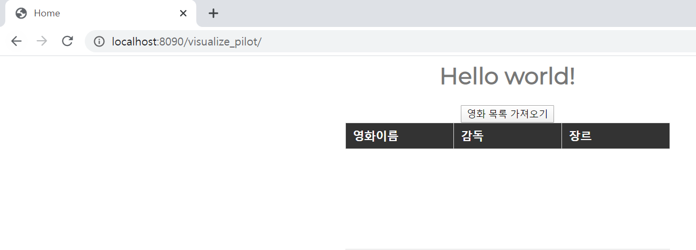
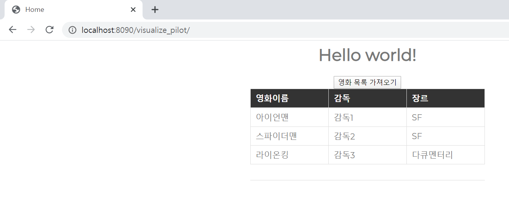

## DataBinding

**restController로 데이터를 호출해서 해당 데이터를 html의 Dom 영역에 데이터를 바인딩한다.**

1. home.jsp

   - tbody 태그 jstl 문법 제거 및 id 설정

   - head 태그 안에 common_resource.jsp, home.js, home.css 호출 태그 추가

   - 영화 목록 가져오기 버튼 추가

     ```jsp
     <%@ page language="java" contentType="text/html; charset=UTF-8"
         pageEncoding="UTF-8"%>
     <%@ taglib prefix="c" uri="http://java.sun.com/jsp/jstl/core"%>
     <html>
     <head>
      
     <title>Home</title>
         <%@include file="./common_resource.jsp"%>
         <script type="text/javascript" src="${pageContext.request.contextPath}/resources/js/home.js"></script>
         <link href="${pageContext.request.contextPath}/resources/css/home.css" rel="stylesheet" />
      
     </head>
     <body>
         <h1>Hello world!</h1>
          <button id = "load_movieList" type = "button">영화 목록 가져오기</button>
         <table>
             <thead>
                 <tr>
                     <th>영화이름</th>
                     <th>감독</th>
                     <th>장르</th>
                 </tr>
             </thead>
             <tbody id ="movieList" >
             </tbody>
         </table>
      
      
     </body>
     </html>
     ```

2.  jquery-1.12.4.min.js 

   - jquery-1.12.4.min.js는 FrontEnd 개발을 쉽게 하기위한 library
   - 다운로드 받아 resource폴더 아래 둔다

3. common_resource.jsp

   - jquery-1.12.4.min.js 를 불러오는 역할로 해당 프로젝트에 항상 사용하는 자원을 미리 만들어 놓은 공통자원 파일

   - 공통자원 파일을 만들어 놓으면 다른 화면을 만들 때 불러오도록 하면 개발을 좀 더 빠르게 진행 할 수 있음은 물론 유지보수시에도 가독성이 좋다

     ```jsp
     <%@ page language="java" contentType="text/html; charset=UTF-8"
         pageEncoding="UTF-8"%>
     <%@ taglib prefix="c" uri="http://java.sun.com/jsp/jstl/core"%>
     <html>
     <head>
         <script type="text/javascript" src="${pageContext.request.contextPath}/resources/js/jquery-1.12.4.min.js"></script>
     </head>
     </html>
     ```

4. servlet-context.xml 수정

   - js파일은 js폴더 아래에 css파일은 css폴더 아래에 있다는 경로 설정

     ```xml
     <resources mapping="/js/**" location="/resources/js/" />
     <resources mapping="/css/**" location="/resources/css/" />
     ```

5. home.css : 화면 디자인 파일 작성

   ```css
   @import url(https://fonts.googleapis.com/css?family=Montserrat);
    
   body {
       color: #777777;
       font-family: 'Montserrat', sans-serif;
       text-align: center;
   }
    
   table {
       margin: auto;
       text-align: left;
       border-collapse: collapse;
       border-bottom: 1px solid #ddd;
   }
    
   thead {
       background-color: #333;
       color: #fff;
   }
    
   thead, tbody {
       display: block;
   }
    
   th, td {
       padding: 8px 10px;
       border: 1px solid #ddd;
       width: 130px;
   }
    
   tbody {
       height: 140px;
   ```

6. home.js 파일 작성

   - 코드의 내용은 버튼을 클릭하면 url을 통해 데이터 호출(restController)하고 호출 성공시 dataBinding을 하는 코드

   - $로 시작하는 부분
     
     - $로 시작한다는 것은 현재 jquery를 이용해 개발하고 있음을 의미하며, home.jsp 파일에서 해당 라이브러리를 불러오고 있음을 확인 할 수 있습니다.
     
   - $(document).ready 영역
     * $(document).ready 영역은 html 구조를 먼저 모두 읽은 후 코드를 수행하겠다는 내용으로 위 코드에서는 home.jsp의 태그 및 구조를 모두 읽고 load_movieList 함수를 호출합니다.
     * 해당 부분이 중요한 이유는 데이터 바인딩 할 영역을 불러오지 못했지만 데이터를 바인딩하는 경우 해당 영역을 찾지 못해 오류가 발생하는 요인이 될 수 있기에, 오류가 나지 않도록 태그를 먼저 읽을 수 있도록 처리하는 영역이기 때문입니다.
     
   - $.ajax 영역
     -  $.ajax의 경우 WAS(SPRING) 영역으로 데이터를 호출하기 위해 jquery에서 제공해주는 방법으로 호출을 위한 url, 서버에 전송 할 data, 호출 전 수행할 코드, 동기/비동기 방식 여부 등을 설정 후 데이터 호출을 합니다.
     - 해당 코드에서는 List방식으로 데이터를 가져오기때문에 데이터 호출 성공시 <tr>.. </tr>형식의 태그를 동적으로 만들어 id가 movieList인 영역에 Data를 바인딩하고 있습니다.
     
     ```js
     $( document ).ready(function() {
         load_movielist();
     });
      
      
     function load_movielist(){
         var movieList;
         var html;
         $("#load_movieList").click(function(){  
         
             var url="/visualize_pilot/restex";  
     
             $.ajax({      
                 type:"POST",  
                 url:url,        
                 success:function(args){
                     movieList = args;
                     for(var i=0;i<args.length;i++){
                         html = "<tr>"
                                 + "<td>" + args[i].movieName + "</td>" 
                                 + "<td>" + args[i].director + "</td>"
                                 + "<td>" + args[i].type + "</td>"
                                 "</tr>";
                         $("#movieList").append(html);
                     }
                     
                     console.log(args);
                 },   
                 beforeSend:function(){
                     $("#movieList").empty();  
                 },
                 error:function(e){  
                     alert(e.responseText);  
                 }  
             });  
           
         });
     }
     ```

   

   