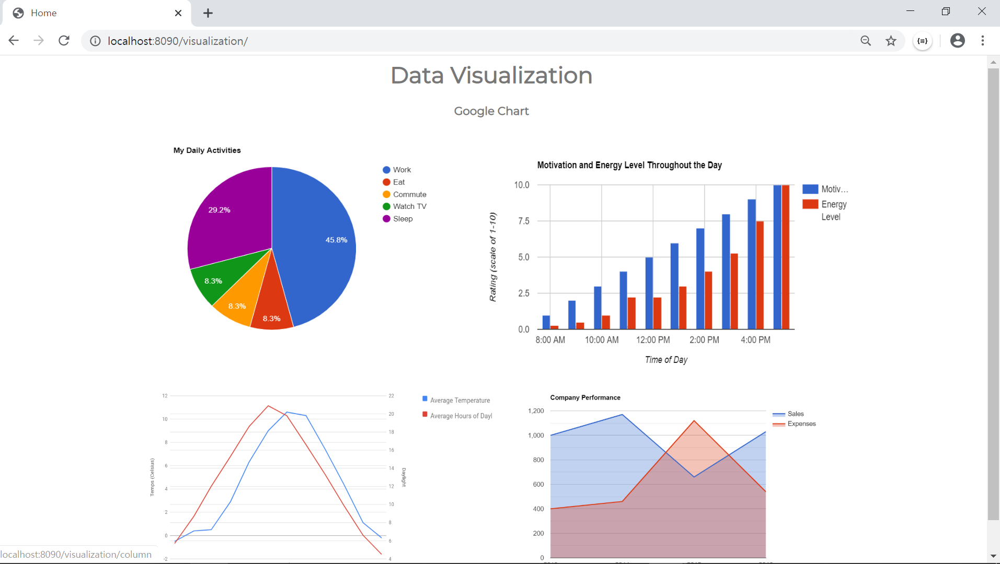
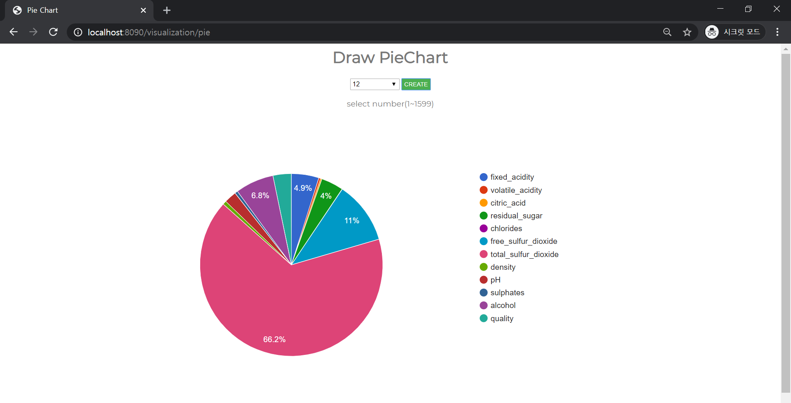
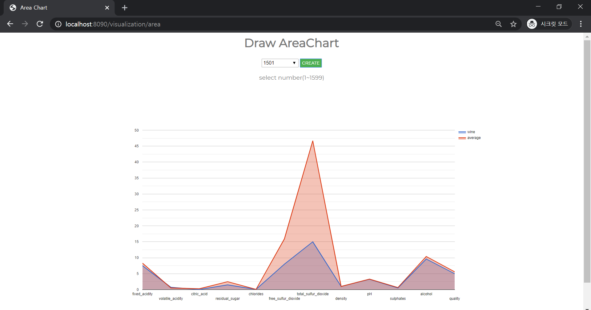

### 1. 데이터 시각화

- Google Chart를 이용해 품질 데이터를 시각화하는 페이지 구축

- 차트 데이터(wine_quality)

  - 

- 데이터 시각화 화면

  1. 메인(home)

     - 각 차트 이미지를 클릭하면 해당 차트를 만들 수 있는 페이지로 넘어감

     - 

  2. PieChart
     - 조회하고자 하는 wine의 번호를 선택
     - 
  3. ColumnChart
     - 조회하고자 하는 wine의 번호를 선택
     - 각 항목의 평균치와 비교
     - 
  4. LineChart
     - 조회하고자 하는 wine의 번호를 선택
     - 각 항목의 평균치와 비교
     - 
  5. AreaChart
     - 조회하고자 하는 wine의 번호를 선택
     - 각 항목의 평균치와 비교
     - 
  
  
  
  ### 2. 질문사항
  
  - 저는 코드를 마구잡이식으로 작성해서 항상 문제가 발생합니다. 소위 말하는 클린 코드를 작성하기 위해서 어떤 책이나 문서, 코드 등을 참고해야하는지 조언 부탁드립니다.
  
  
